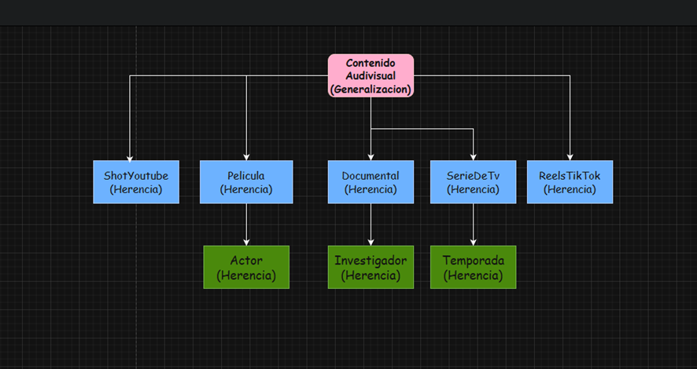

## Estructura del proyecto

Dentro de esta carpeta encontraran las clases que se crearon

```powershell
src/uni1a
```


```powershell
src/uni1a/Reel
```

# 🎬 Deber POO
📘 Descripción del Proyecto

Este proyecto forma parte de la Unidad 2: Relación entre Clases de la asignatura Programación Orientada a Objetos en la Universidad Politécnica Salesiana.
El objetivo es ampliar y mejorar un sistema Java existente de gestión de contenidos audiovisuales, aplicando los principios de herencia, asociación, agregación y composición.

El sistema permite gestionar diferentes tipos de contenidos audiovisuales como películas, series de TV, documentales, y se ha extendido con nuevas clases y relaciones para demostrar el uso avanzado de POO en Java.

🎯 Objetivos del Proyecto

Aplicar los conceptos de herencia, agregación, composición y asociación entre clases.

Extender el código base de la Unidad 2 con nuevas funcionalidades y clases.

Desarrollar un diagrama UML completo que refleje las relaciones entre clases.

Crear un sistema funcional en Java con una estructura clara y bien documentada.

Gestionar el proyecto usando Git y GitHub, con commits descriptivos y buenas prácticas.

🧩 Clases y Funcionalidades Nuevas

🔹 Nuevas Clases Agregadas

Actor

Relacionada con la clase Película.

Representa a los actores que participan en las películas.

Relación: Asociación (una película puede tener varios actores).

Temporada

Relacionada con la clase SerieDeTV.

Contiene los episodios correspondientes a una temporada de una serie.

Relación: Composición (una serie no existe sin sus temporadas).

Investigador

Relacionada con la clase Documental.

Representa a los investigadores o expertos que participan en el documental.

### Diagrama de clases
